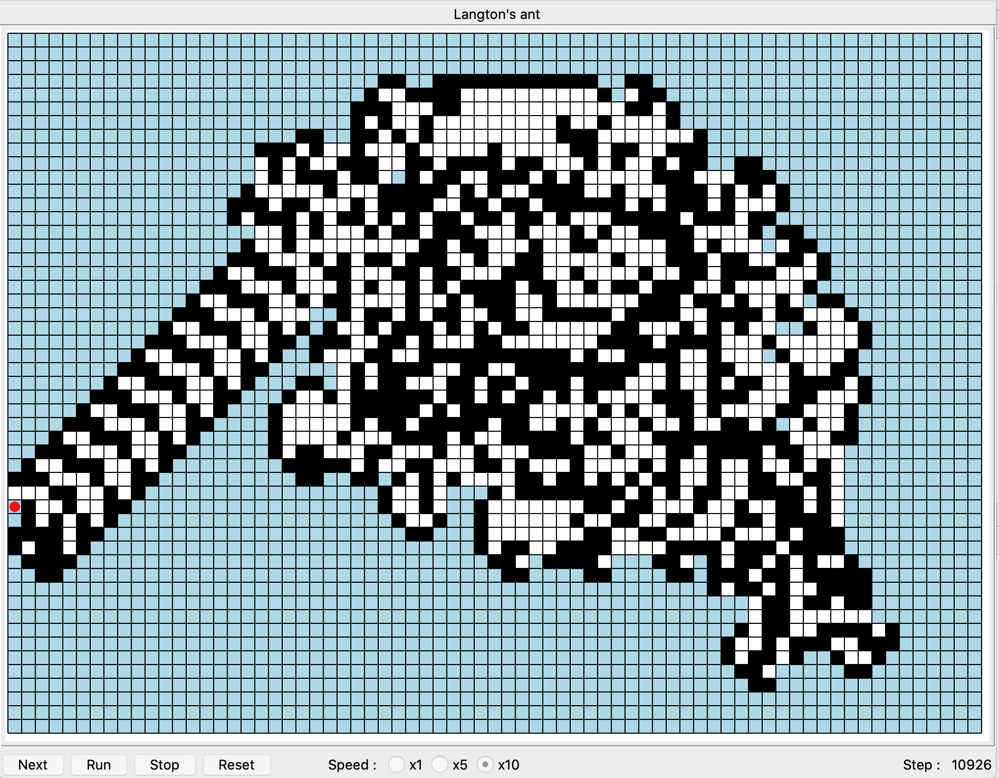

# Langton's ant trajectory visualisation GUI


### Langton's ant
Langton's ant walks on a 2D grid with the following rules :
  - If it is on a white cell, it turns right and the cell it was on becomes black
  - if it is on a black cell, it turns left and the cell it was on becomes white

The movement rules are simple but the ant's trajectory is surprisingly complex:
  - for the first ~ 100 steps, it follows a pretty symmetrical pattern
  - for the next ~ 10k moves, the trajectory becomes chaotic
  - then it enters a cyclic pattern moving endlessly, called the "highway"

This program offers a TkInter GUI to visualize the trajectory of the ant with different speeds.


### Running the program

The program requires Python 3 and the graphical library Tkinter.
On macOS they can be installed with :
```
brew install python3
brew install python-tk
```

Then the program can be ran with :
```
python ./langton_ant.py
```

A GUI will be displayed where the ant's trajectory can be visualized :

